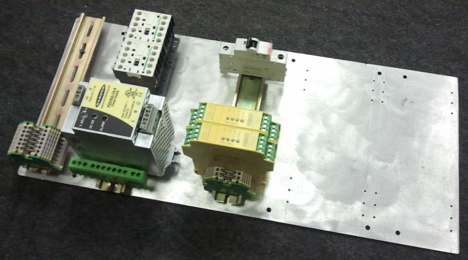
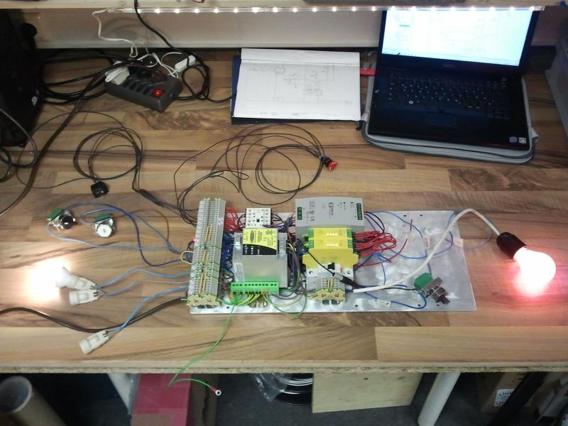
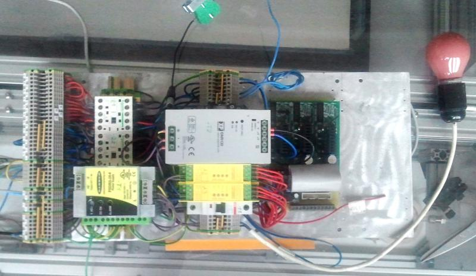
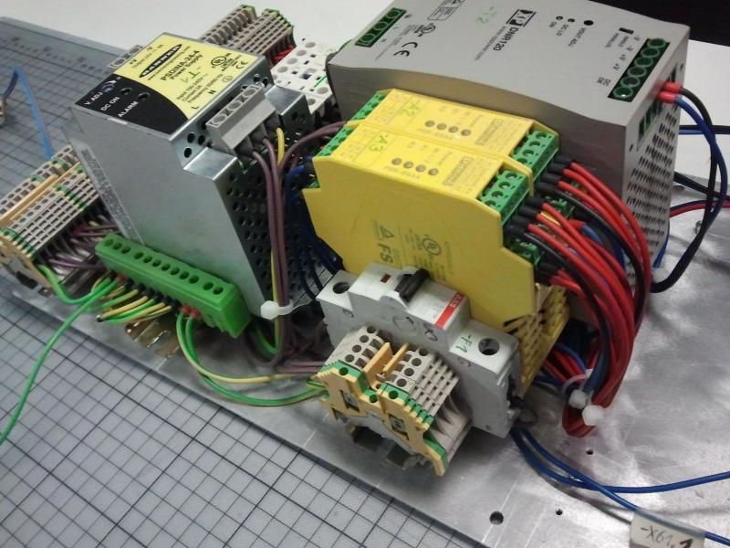
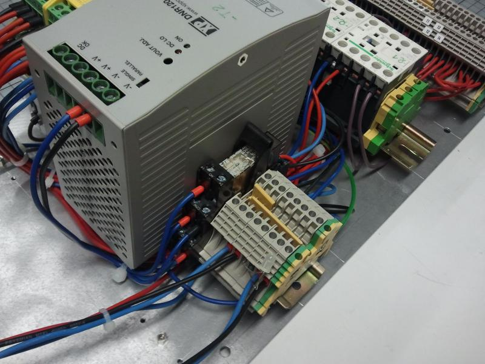
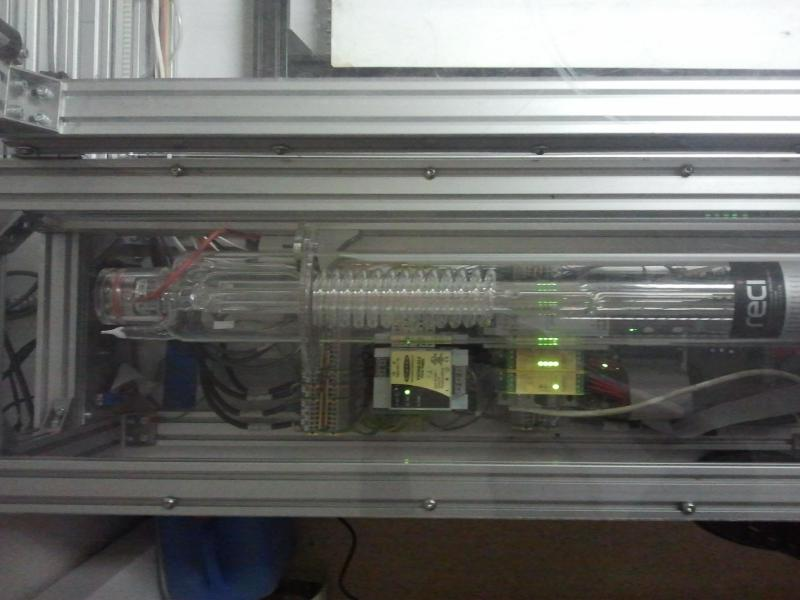

h1. Elektronik

h2. Links

* [Sicherheitsschaltung](safetycircuit.md)
* [Lasernetzteil](powersupply.md)

h2. aktueller Stand

 * Die Elektronik für die [[Sicherheitsschaltung]] aus der Lasersaur Dokumentation wurde als zu kompliziert verworfen. Umgesetzt wird eine Eigenentwicklung. dafür wurden zusätzliche Komponenten gekauft die über die Lasersaur BOM hinausgehen. 
 * Eigenlösung, abweichend von der Lasersaur-Elektronik wurde am 10.3.2014 zusammen mit Linux CNC getestet, wenn Notaus während der Fahrt gedrückt wird, wird ev. der SM Treiber zerstört
 * Eine Schaltung für die Kontrolle der Betriebszustände (Durchfluss Pumpe, Temperatur Kühlwasser/Motoren, Luftdruck, Betriebsspannungen, Rauchmelder, Betriebsstunden usw.) wurde vorerst zurückgestellt, aber spätestens nach dem Abschluss der Inbetriebnahme sollte auch dieser Punkt angegangen werden.

h1. Realisierung

h2. Schaltung

Unten in der Dateiliste befindet sich der elektrische Plan unseres LaserSaurs (Ansprechpartner Olaf Bitter). 

Erstellt habe ich den Plan mit "QElectroTech":http://qelectrotech.org. Das Programm ist noch nicht ganz stabil aber frei und ganz nett zu bedienen.

Enthalten ist:

 * Übersichtsplan
 * PC-Schnittstelle (Parallelport mit Flachbandkabel)
 * Einspeisung, Last- und Steuerstromkreise
 * Sicherheitsschaltung mit NOT-AUS und Deckel-Überwachung (Kategorie 4 - PL e)
 ** Not-Aus schaltet alles aus, auch das externe Kühlaggregat (24V und 230V)
 ** Das Gerät muß nach Betätigung des Not-Aus mit einem Taster (-S1) wieder eingeschaltet werden.
 ** Deckel-Überwachung mit zwei Positionsschalter, da der Deckel sich an einer Seite öffen kann, wenn die Mitte noch zu ist.
 ** Ein- / Aus-Schalter per Software mit Signal "Amplifier Enable" wird durch High-Side-Switch (VN750) in -A1 realisiert
 ** 5V Steuerspannung wird aus der 24V Steuerspannung in -A1 erzeugt und über das Flachbandkabel -W100.26 weitergegeben
 * Motorsteuerung und Endlagenschalter
 ** für die Endlagenschalter habe ich 4-poliges Kabel eingezeichnet, es wird aber 8-poliges Netzwekkabel verwendet.
 * Laseransteuerung mit 1 kHz PWM (-A7)
 ** Glättung erst einmal mit RC-Glied
 ** 24V Versorgung an -A7 für evt. OPV Glättung vorbereitet
 * Klemmenpläne
 * Geräteaufbauplan

h3. TODO

 * Bauteile ohne Artikel:
 ** X104 (Steckverbinder für Kühler-Ventilatoren und Sensor)
 ** K1 (Zuschalten der Motorbetreibsspannung (+24V_1)
 ** P1 (Meldeleuchte "Machine an")
 * 
 * Black-Boxen -A1, -A6, -A7 mit Leben erfüllen (Schaltungen entwerfen)
 * Aufbau für -A1 bis -A7 konstruieren
 *
 * Zusatzschaltungen: Betriebsstundenzähler, Leistungsmesser, u.s.w.

h3. Changelog
 
Ver. 1.2.1.1

 * Blattformat A3
 * Klemmen korrekt bezeichnet
 * Status der Sicherheitsschaltung geht über Signal "Error" zum PC
 * Absicherung der 230 V für Kühler mit -F1 (LS C 1 A)
 * Absicherung der 24 V für Kühlerlüfter über Netzteil -T1 und zusätzlich mit Schmelzsicherung -F2 (3 A)
 * Klemmenpläne erstellt
 * Aufbau erstellt

Ver. 1.1.1.4

 * der Plan wird stückweise präziser
 * Stecker Klemmen und Kabelbezeichnungen hinzugefügt (noch nicht vollständig)

Ver. 1.1.1.2

 * ext. Kühlaggregat wird nur über NOT-Aus gesteuert. Sicherung zum Schutz des Relaiskontaktes notwendig
 * Positionsschalter und Notausschalter müssen natürlich in Reihe geschalten werden

Ver. 1.1.1.1

  * erster Versuch

h2. Aufbau

Die Betriebsmittel werden auf drei Tragschienen verteilt. Zusammen mit den Elektronikplatinen wird alles auf eine 500 x 235 mm großen Montageplatte aufgebaut. Die Elektronik kann auf zwei Euro-Platinen (100 x 160 mm) aufgebaut werden. Diese können auf die Montageplatine nebeneinander befestigt werden.

Und so sieht der Aufbau aus:

 Erste Betriebsmittel auf Hutschiene montiert

 erster Test des Aufbaues

 Blick auf den fertigen Aufbau

 Ansicht der Sicherheitsrelais

 Ansicht der Last-Relais 

 Ansicht der großen Klemmenleiste

 Eingebaut im LaserSaur

h2. Aufbau der Uni-Platinen "Interface" und "Steuerung"

http://h2371910.stratoserver.net/attachments/97/DIT-Laser-2016-08-04.sch.pdf KiCAD Stromlaufplan der Uni-Platinen "Interface" und "Steuerung"

h3. Schaltungsbeschreibung

Die digitalen Eingangssignale an -X56 sind an das SPS-Eingangsverhalten nach EN61131-2 Typ1 angelehnt. Die Sensoren (Endlagenschalter) werden durch eine kurzschlußfeste +24V Spannung versorgt. Eine grüne LED zeigt den Schaltzustand an. Sie leuchtet wenn der Eingang auf High (+24V) steht.

Die Eingangssignale werden durch den Triggerbaustein 74LS14 zum Parallelport weitergeleitet.

Zum Einschalten der Maschine wird das Linux-CNC-Signal "Amplifier Enable" verwendet. Am Parallelport kommt das Signal an /SelectIn an.  Dieses Signal wird mit dem externen MaschineEnabled-Signal UND-Verknüpft. Ein HighSide Switch (U6) schaltet die +24V Spannung für die Steuerung der Machine ein.

Die PWM zur Leistungseinstellung des Lasers wird durch ein einfaches RC-Glied geglättet.

Um die Motortreiber zu schützen wird bei abfallen der Spannung +24V_Save (NOT-AUS) das Reset-Pin der Motortreiber auf LOW gezogen. Für die Pegelanpassung habe ich einen diskret aufgebauten Schmitt-Trigger aufgebaut.

h3. TODO

* +24V_Save kommt an Input "Error" (Notaus --> Linux-CNC.ESTOP IN)
* Kurzschlußfeste 24V (Imax= 100mA)  Versorgung an Bedienelektronik (X205)
* PWM-Filter überarbeiten bzw. entfernen
* zusätzliches Enable-Pin damit Laser beim Ein-/Ausschalten nicht kurzeitig an geht

h3. Bilder

!P8021414_Interface_LS-web.jpg! Leiterplatte Interface: Leiterseite 

!P8021415_Interface_BS-web.jpg! Leiterplatte Interface: Bestückungsseite 

!P3080936-Steuerung_LS-web.jpg! Leiterplatte Steuerung: Leiterseite 

!P3080935-Steuerung_BS-web.jpg! Leiterplatte Steuerung: Bestückungsseite 

p>. _Olaf_

h2. Verbaute Motore 

*Typ:* Nanotech ST4118M1206-A
*Kenndaten:* 3.7V 1.2A

!img_20140331_202552.jpg!

*Typ:* ST5918M3008-B
*Kenndaten:* 2.1V 3.0A

!img_20140331_202633.jpg!

h2. Ansprechpartner: Robert 

  * zur Ansteuerung der Schrittmotoren kommen Leiterplatten mit dem IC TA8435H von Toshiba zum Einsatz, dieser ist kompatibel zu Nanotech IC 
  * gesteuert wird der IC über ein Signal welches die Richtung festlegt und ein Clock Signal 1 Takt=1 Schritt diese Variante der Ansteuerung ist allgemein üblich, so dass die Steuerung auch gegen andere Schrittmotortreiber ohne Änderungen in der Software zu ersetzten ist
  * für den großen Nema23 Schrittmotor könnte ein IC die eine Wicklung bestromen und der zweite IC die andere 
  * Spec des TA8435H 

    * unterstützt bipolare Schrittmotoren mit 1,5A (average) und 2,5A (Peak)
    * Bipolar 
    * micro step
    * PWM chopper
    * Berechnung Shunt Widerständ für kleinen Motor R=U/I=0,8V/1,2A=0,666Ohm P=U*I=0,8V*1,2A=0,96W
    * Berechnung Shunt Widerstand für großen Motor R=U/I=0,8V/1,5A=0,533 Ohm P=U*I=0,8V*1,5A= 1,2W
   