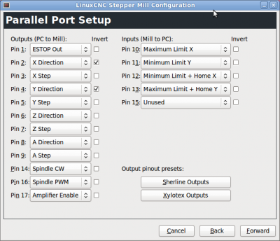

# Software

## Generelle Bedienung

### Maschine anschalten

  * PC starten
  * !!! bug "Wenn PC nicht gestartet ist, bleibt der Laser bei geschlossener Klappe an* ), wenn Maus nicht geht Maus abziehen und wieder anstecken"
  * Abluft ins Fenster
  * Kaltgerätestecker des Lasers anstecken 
  * Notaus Taster heraus drehen falls gedrückt, Taste "Power" On drücken
  * Einloggen auf PC 
  * Linux CNC starten (Launch Ditlaser)
  * In Linux CNC "Notaus" Button herausnehmen und "An" Button drücken 
  * X/Y Achsen : "Home"
  * Z Achse "Home"+" Touch off"
  * Gcode Datei laden -> Vorschau der Fahrwege wird dargestellt
  * Abluft, Druckluft (Hand auf Komressor legen), Kühlung (plätschern) prüfen
  * Play Button in Linux CNC drücken 
  * Bei Problemen Klappe öffnen ->Laser geht aus, Notaus nur im Notfall betätigen

## Software Allgemein

 * Links zur [[Software]] Recherche
 * Beauftragte: Markus, Olaf, Robert
 * als low-level Software ist vorerst ein Linux PC geplant auf dem LinuxCNC G-Code interpretiert und über den Parallelport die Schrittmotorteiber (vorhandene Eigenentwicklung) ansteuert. 

## Dateiformat

 * Die Ausgabe erfolgt aus Inkscape heraus. Wenn es sich eine Datei in Inkscape öffnen lässt und nach dem Import den richtigen Maßstab hat passt es. Da Inkscape OpenSource ist, kann man dies vorher auf dem eigenen Rechner installieren und den Import vorher testen. Häufig werden die Daten zwar importiert aber der Maßstab stimmt nicht. Dies sollte man immer kontrollieren. 
 * Es ist es eine gute Idee sich den funktionierenden Workflow zum Export/Import der Daten zu notieren. Falls es Probleme gab auch hier nach Programmen sortiert im Wiki, damit die Anderen (und man Selbst nach einiger Zeit) es leichter haben. 
 * Trotzdem ist es gut die Software welche zum Erstellen verwendet wurde auf einem Notebook mitzubringen um eventuelle Änderungen besser durchführen zu können und auch die geänderten Daten wieder im Originalprogramm zu haben. 
 * Der Arbeitsbereich sollte maximal 1200x600mm sein und am Besten der Materialgröße entsprechen. Bitte noch die Maße überall in Inkscape auf "mm" statt Pixel stellen, dies verbessert die Kontrolle des Maßstabs. 
 * Wenn möglich sollten keine Objekte außerhalb des Arbeitsbereiches sein. Doppelte Linien übereinander(kosten doppelte Laserzeit), überflüssige Punkte und Objekte die wegen keiner/weißer Farbe oder zu kleiner Linienbreite unsichtbar sind sollten vermieden werden.
 * Im Maßstab 1:1 in PDF drucken klappt meist sehr gut, dazu ein möglichst großes Papierformat wie A0 und einen PDF Druckertreiber einstellen. Möglich PDF Druckertreiber sind FreePDF, Foxit Read PDF Printer, PDFCreator u.ä. Damit kann man Daten gut aus jedem beliebigen Programm exportieren. Auch z.B. aus Trial- oder Studentenversionen bei dehnen die Exportformate eingeschränkt sind. 
 * Beim Autocad Format DXF/DWG gibt es immer mal Probleme diese in Inkscape zu öffnen. Eventuell kann man einen Umweg über ein anderes Programm wie Illustrator gehen.
 * Die Linienbreite ist nicht ganz so wichtig wie beim Zinq. Je nach Größe der Teile 0,1-1mm einstellen, so das man die Teile auf dem Bildschirm noch sieht. Wenn etwas nur angeritzt werden soll, dann in einer anderen Farbe.

## Workflow

* Vektor Datei mit beliebiger Software erstellen und datei als svg oder pdf speichern 
* Vektor Datei in Inkscape öffnen und mit Plug-In Visicut aufrufen     
* G-Code mit "Visicut":http://visicut.org erzeugen
* G-Code in Linux CNC öffnen welches den Lasercutter steuert
   * Nach Start von Linux CNC "Home Axis" für X/Y und "Touch off" für Z

## Linux CNC 

### Betrieb LinuxCNC

 * auf dem Desktop liegt ein Shortcut zum Start mit der ditlaser Konfiguration
 * für direkte Kontrolle des Lasers zu Testszwecken siehe [[Howto]]  

### Konfiguration LinuxCNC

Hier ein Link zu einem Projekt das Beaglebone Black oder Raspberry PI als Computer für einen LinuxCNC Abkömmling verwendet "(Machinekit)":http://www.machinekit.io

Verschiedene Links zu LinuxCNC Konfigurationen:

  * https://github.com/jedediah/hacklab-engraver
  * https://github.com/bjj/2x_laser
  * http://mattikariluoma.com/?p=320

Die Konfiguration von Pinout, Treiberparametern erfolgt mit "LinuxCNC Stepconf wizard"
Um die aktuelle Konfiguration zu bearbeiten ist in Stepconf die Datei ''/home/ditlaser/linuxcnc/configs/ditlaser.stepconf'' zu modifizieren.

Die Konfiguration liegt in ''/home/ditlaser/linuxcnc/configs''  
Die Konfiguration wird mit git verwaltet https://github.com/Fablab-Dresden/ditlaser-linuxcnc_config

#### Pinout 

Als Basis wurde Sherline gewählt. zusätzlich wurden Endschalter und Referenzpunkt definiert

### PC Hardware für Linux CNC

 * "spezielle Systemanforderungen":http://wiki.linuxcnc.org/cgi-bin/wiki.pl?Hardware_Requirements
 * Ein Mainboard am besten eins aus dieser "Liste":http://wiki.linuxcnc.org/cgi-bin/wiki.pl?Latency-Test

## Erzeugung G-Code

Prinzipiell kann G-Code aus verschiedenen Quellen verarbeitet werden zum Beispiel direkt aus einem CAD Tool oder über einen CAM Prozessor auf einer beliebigen Vektordatei. 
Im Verzeichnis Justagetools sind verschiedene kurze G-Code Dateien, welche als Ausgangspunkt für eigene Entwürfe dienen können.
Enthält das zu lasernde Objekt ausschließlich Rechtecke ist die manuelle Erstellung einer G-Code Datei oft schneller als die Erstellung mit CAD Tools oder Vektorzeichenprogrammen.  

!!! warning "Die Geschwindigkeit für Leerfahren kann nur mit einem Schieberegler in LinuxCNC eingestellt werden und nicht im G-Code"

??? warning "Lasterleistung"
    * Die Laserleistung kann von "S0" bis "S100" eingestellt werden. 
    * Die verfügbare Leistung von 100W wird nicht linear auf S0-S100 umgesetzt. Der Laser fängt erst ab S20-S30 an überhaupt Leistung abzugeben. 
    * Ein Aufrufen von "S0" schaltet aber den Laser dauerhaft ab deshalb S1 aufrufen um Laser während Leerfahrten abzuschalten

### Links zu weiteren Möglichkeiten gcode zu generieren (z.B. mit Hilfe von Inkscape):

 * https://github.com/DingFabrik/laserapp
 * http://www.shapeoko.com/wiki/index.php/Advanced_Software
 * https://knowledge.hacklab.to/wiki/Laser_Manual#HowTo:_Load_your_image_for_laser_cutting
 * http://wiki.fubarlabs.org/fubarwiki/Laser-Cutter-Inkscape-Setup-Notes.ashx
 * http://wiki.thinkhaus.org/index.php?title=Laser_Cutter
 * Mit dem demnächst erscheinenden Inkscape 0.91 sind die gcodetools (ein Plugin für inkscape zum erstellen von gcode) in inkscape enthalten.