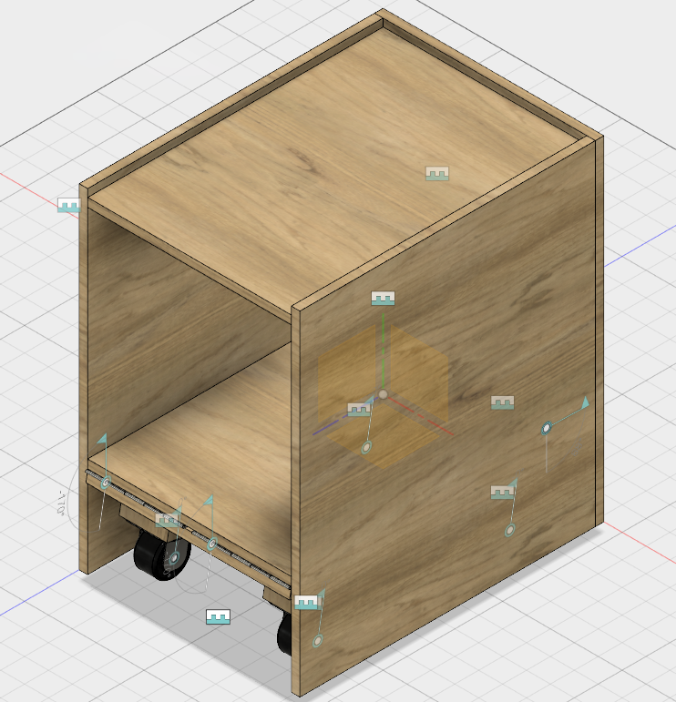
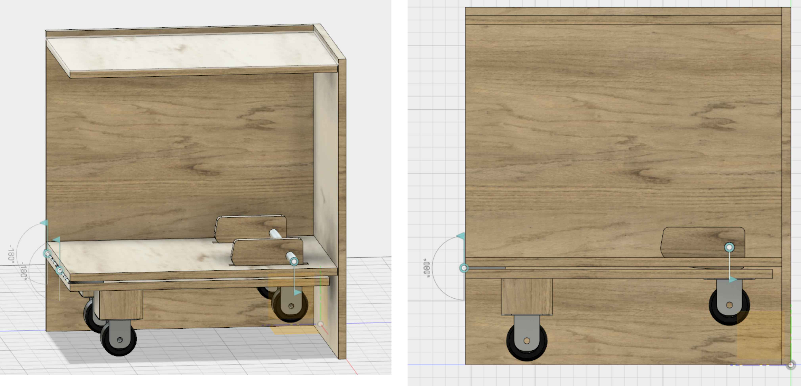
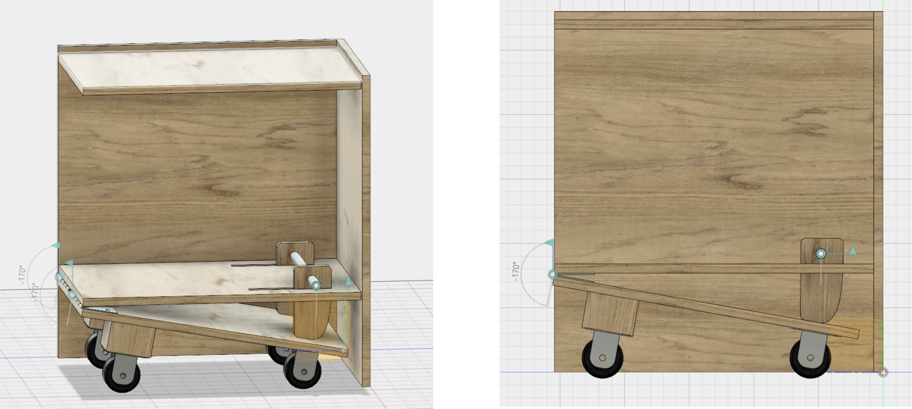

# Projektbeschreibung 
## Stand der Dinge

*Bisher*

* Ausklappmechanismus ist ausgearbeitet und in Formeln gegossen, sodass er anpassbar ist
* Erstes CAD - Modell der Grundstuktur steht
* Grobe Form der Kurvenscheibe wurd entwickelt

*Ausblick*

* Wellen-Nabenverbindung zwischen Kurvenscheibe und Metallrohr überlegen
* Feedback zum bisherigen Stand einbeziehen
* Aufnahme für Eurokisten in Schubladensystem überlegen
* Schubladensystem in CAD - Modell übertragen

## Warum ein neuer Container

Warum wird überhaupt ein neuer Rollcontainer konstruiert? Wie vielen wahrscheinlich schon aufgefallen ist, ist der alte Container durch die fehlende Rückwand sehr instabil, was vor allem, wenn man teueres Gerät darauf abstellen will problematisch ist. Jedoch ist der Hauptgrund der, dass man jetzt zu Beginn des Fablabs einen Referenzcontainer konstruiert mit erweiterten Features, der immer wieder nachgebaut werden kann.

## Funktionsübersicht

Die bisherigen gewünschten Hauptfeatures sind
* Ein Klappmechanismus für die Rollen
* Ein flexibles Schubladensystem

Die Eurokisten werden bei dem konstruierten Kasten längs in den Container geschoben. Jedoch kann man das auch gerne noch verändern. Als Höhe ist bisher Tischhöhe (ca. 70cm) angedacht, welche durch ein Holzmodul, was auf den Container gestellt wir,d auf Stehtischhöhe gebracht werden kann. Dadurch ist es auch möglich an den 3D - Druckern im sitzen zu arbeiten, Barrierefreiheit zu gewährleisten und die Drucker auch für Kinder gut erreichbar zu machen. 
In dem CAD - Modell ist zu sehen, dass die Rollen fest, sprich nicht drehbar sind. Dies wird aber noch überarbeitet. Wobei die Frage ist, ob es ausreicht, wenn zwei der vier Rollen drehbar sind. Insgesamt sind die Bauteile Rolle und Scharnier nur Modelle, welche nur einen bedingten Bezug zu im Rosenwerk vorhanden Rollen bzw. Scharniere haben.

### Klappmechanismus

Der Klappmechnismus wird durch eine Kurvenscheibe realisiert, welche durch Drehung die Platte, auf der die Rollen befestigt sind nach unten drückt. Dabei ist die Konstruktion so ausgelegt, dass die Rollen im ausgeklappten Zustand in einer Ebene sind und der Container somit gerade ist.

*Vorteile*

* Container steht sehr stabil, wenn die Rollen eingeklappt sind
* wenig Bauteile und dadurch robust

*Nachteile*

* viel Bauraum wird für die Konstruktion verwendet

### Mathematik

### Verstellbares Schubladen System

Bisher werden die Schubladen durch Schienen, welche mit Einschlagmuttern an den Wänden befestigt werden, festgehalten. Man könnte natürlich verschiedene Einbauhöhen dadurch realisieren, dass man einfach viele Einschlagmuttern verwendet. Da diese jedoch sehr teuer sind, ist dieses eine teure Lösung.
Stattdessen könnten normale Muttern verwendet werden, welche durch Fräsungen in den Seitenwänden des Containers versenkt werden.