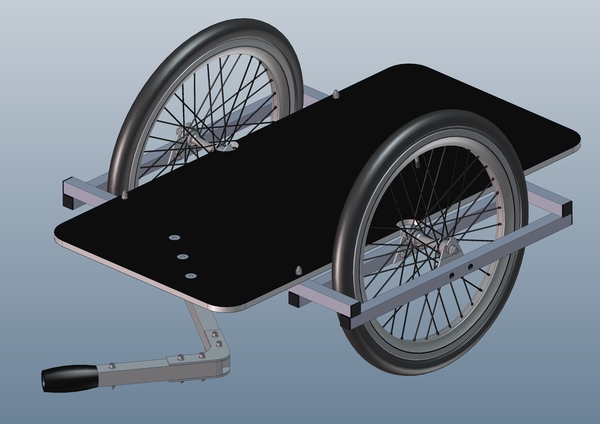

# Projektbeschreibung 

## Konstruktionsdateien

* [Material_VeloZack_1.0_.ods](Material_VeloZack_1.0_.ods)
* [Velo_Zack_1.0_Gesamtzeichnung.PDF](Velo_Zack_1.0_Gesamtzeichnung.PDF)
* [vorerst_Deichselprofil_kurz.PDF](vorerst_Deichselprofil_kurz.PDF)
* [vorerst_Deichselstrebe_lang.PDF](vorerst_Deichselstrebe_lang.PDF)
* [vorerst_Grundplatte.PDF](vorerst_Grundplatte.PDF)
* [vorerst_L_ngsprofil.PDF](vorerst_L_ngsprofil.PDF)
* [vorerst_Laufradhalter_au_en.PDF](vorerst_Laufradhalter_au_en.PDF)
* [vorerst_Laufradhalter_innen.PDF](vorerst_Laufradhalter_innen.PDF)
* [vorerst_Querprofil.PDF](vorerst_Querprofil.PDF)